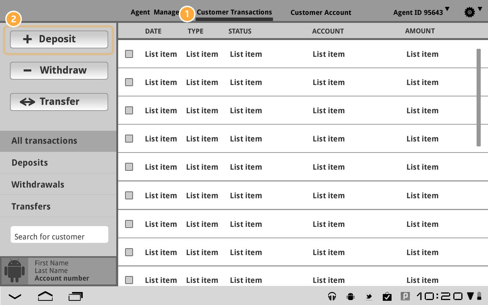

# Mission 2

Deposit and withdrawal functionalities are crucial for a functional bank account.

I'll describe the UX first as per the presented questions.

## UX

### Where do these flows live?
The deposit and withdrawal functionalities should be integrated into an online banking platform or mobile app.

### How does the user discover them?
The user can discover these functionalities through a dashboard or menu, typically labeled as "Transactions" or "Transfer Funds." (or "Withdraw" & "Deposit" individually)

### What information should we require? How can we simplify?
To process deposit and withdrawal transactions, the platform would require the following information:

1. **Account number:** The user's account number, which is a unique identifier assigned to each account by the bank.

2. **Routing number:** The routing number is a nine-digit code used to identify the financial institution and the location where the account was opened.

3. **External account information:** If the user is transferring funds to another account, they would need to provide the account number and routing number of the external account.

To simplify the process, the platform could pre-populate frequently used account (or historical account) information and allow users to save external account information for future transactions. This would eliminate the need for the user to enter this information every time they perform a transaction.

### Are there any security concerns?
Yes, security is a critical consideration in the implementation of deposit and withdrawal functionalities. The following are some of the security concerns that need to be addressed:

1. **Unauthorized access:** Unauthorized access to the user's account could result in unauthorized transactions.

2. **Authentication:** To mitigate the risk of unauthorized access, the platform should implement robust authentication methods, such as multi-factor authentication, to verify the user's identity before processing transactions.

3. **Encryption:** All transactions should be encrypted to protect sensitive information, such as account numbers and routing numbers, from being intercepted by malicious actors.

## UI Design:

The deposit and withdrawal functionalities should have a simple and intuitive design. The interface should guide the user through the process, making it easy for them to complete transactions. The following is a example for a deposit and withdrawal interface (example picked up from the internet):

The interface should have the following elements:

1. **Navigation bar:** A navigation bar at the top of the screen, allowing the user to access other functionalities within the platform.

2. **Action buttons:** Buttons labeled "Deposit" and "Withdraw" for easy access to the deposit and withdrawal functionalities.

3. **Account selection:** A drop-down menu or list, allowing the user to select the account they want to deposit or withdraw funds from.

4. **Amount input:** A field for the user to enter the amount they want to deposit or withdraw.

5. **Confirmation button:** A button labeled "Confirm" that the user must click to complete the transaction.

6. **Error messages:** Error messages should appear if the entered information is invalid or the account balance cannot cover the transaction.

7. **Loading indicator:** A loading indicator should appear while the transaction is being processed.

In conclusion, the deposit and withdrawal functionalities should be designed with the user in mind. The interface should be simple and intuitive, allowing the user to complete transactions quickly and efficiently. The platform should also implement robust security measures to protect sensitive information and prevent unauthorized access.
